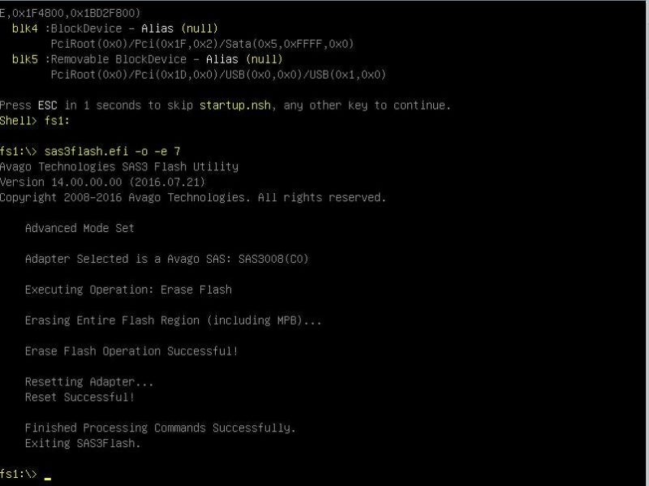

# IT-Mode
This is a updated guide on how to flash IT mode firmware to your LSI/Avago/Broadcom 9300-8i RAID Controller. It is largely based on [this tutorial](https://www.servethehome.com/flash-lsi-sas-3008-hba-e-g-ibm-m1215-mode/) from 2016. Most of the screenshots and techniques used in this guide are from that tutorial and [others](#Resources), but this repo compiles them and includes additional updated information/commentary and makes all of the files used easily accessible.

There are multiple reasons why you may want to flash your RAID controller to make it into a Host Bus Adapter (HBA):
- Using software RAID or filesystem like [ZFS](https://itsfoss.com/what-is-zfs/ "What is ZFS?")
- Avoiding RAID Limitations/Compatibility

[Benefits of Using an HBA](https://www.truenas.com/community/resources/whats-all-the-noise-about-hbas-and-why-cant-i-use-a-raid-controller.139/)

[(Video) RAID vs HBA SAS controllers](https://youtu.be/xEbQohy6v8U)

[(Video) Hardware RAID Is Dead](https://www.youtube.com/watch?v=l55GfAwa8RI)

#### Warning: Before proceeding, do note that this is a risky process. Issues with firmware flashes can render your card “bricked” and unusable/ unrecoverable. We will not be held responsible if this happens to your card. By following this guide, you accept all risks of damaging your card.

## Required Items
- Circuit Board Jumper Pin
- USB Flash Drive
- [Rufus Software](https://rufus.ie/en/ "Rufus")


## 1. Getting the Files
Download all four of these files from this repo and put them on a USB drive. They are necessary for this guide.

- mptsas3.rom&emsp;        :&emsp;      Legacy BIOS OROM
- mpt3x64.rom&emsp;        :&emsp;      UEFI BIOS OROM
- sas3flash.efi&emsp;      :&emsp;      Flashing tool

&emsp; _Note: Other tutorials aimed at flashing different controllers including 9200 models may use sas2flash.efi instead. The 9300 does not work with sas2flash.efi and requires sas3flash.efi._
- SAS9300_8i_IT.bin&emsp;  :&emsp;      IT Mode Firmware

&emsp; _Note: Sometimes there can be trouble with using the "_" and "Shift" keys while in the UEFI shell. If any problems occur, change the name of this file to something without those characters and retry. Just make sure to change your commands accordingly._

## 2. Preparing the Adapter
Here, you will put the jumper pin on the RAID controller pins. Make sure to put them on the correct pins as there may be multiple to choose from.

### &emsp;DO NOT TAKE THE JUMPER PIN OFF UNTIL AFTER YOU POWER DOWN AT THE END OF SECTION 3b.


&emsp;&emsp;&emsp;

If you take the RAID controller off of the motherboard, you can also record the SAS Address of the controller. You can do this later, but if possible, I would recommend doing it now.

&emsp;&emsp;&emsp;

## 3a. Booting the Server into UEFI Shell
Here, power on the system and boot into the system's UEFI shell. This can be done through several ways, depending on your system's manufacturer, as well as the operating system or lack there of:

### Option #1
  - Go to the UEFI menu during startup and select the UEFI shell option. There are many different ways to get to this menu depending on the system's manufacturer, but it can usually be triggered by spamming a function key during startup.
  - [This article](https://www.tomshardware.com/reviews/bios-keys-to-access-your-firmware,5732.html) includes UEFI/BIOS keys for popular brands, as well as Windows and Linux specific ways to access the menu.
### Option #2
  - If Option #1 is not available, you can also access the UEFI shell with a USB flash drive formatted into a bootable Free-DOS drive using Rufus. Launch Rufus, select the correct drive under "Device", select "Free-DOS" under "Boot Selection", and select start.

#### &emsp;&emsp;&emsp; WARNING: ALL FILES ON THE SELECTED DRIVE WILL BE DELETED.
- After has completed formatting to Free-DOS, create a folder on the root of the USB called "EFI". Inside of "EFI", create another folder named "Boot". Move the bootx64.efi file into the "Boot" folder (Resulting filepath is EFI/Boot/bootx64.efi). Also, make sure to add the rest of the required files to the root of the USB.

&emsp;&emsp;&emsp;

#### &emsp;&emsp;&emsp;Here is what your drive should look like after formatting it in Rufus and adding back the required files.

&emsp;&emsp;&emsp;

## 3b. Resetting the Adapter
1. You should find yourself at a command line showing ```Shell>```.
2. Now, find to find all available drives on the system, type ```map```.
3. Your USB drive should be named something along the lines of "Removable Hard Disk". Mount to the alias of that drive. Ex: ```mount fs0```. Your terminal should now read ```fs0:\>```.
4. Type ```dir``` to see the filesystem on that drive. If you do not see the files you put on the USB drive, redo the past few commands until you find the correct drive.
5. Type these two commands:

&emsp;&emsp;```sas3flash.efi -list```

&emsp;&emsp;&emsp;This shows the SAS Address as mentioned earlier. Record the SAS Address if you haven't already.

&emsp;

&emsp;&emsp;```sas3flash.efi -f SAS9300_8i_IT.bin -noreset```

&emsp;&emsp;

&emsp;&emsp;&emsp;This erases the running flash/bios on the RAID controller. 

### &emsp;Power down the server and take the jumper pin off of the RAID controller.

## 4. Flashing the Controller
```sas3flash.efi -o -e 7```

- Erases the card's NVRAM

&emsp;

```sas3flash.efi -f SAS9300_8i_IT.bin -b mptsas3.rom -b mpt3x64.rom```
- This flashes the new UEFI and Legacy BIOS firmware with ROM

&emsp;

```sas3flash.efi -o -sasadd XXXXXXXXXXXXXXXXX```
- Here, replace the X's with your SAS Address. DO NOT USE HYPENS, SPACES, ETC.
- This  flashes the SAS Address back onto the HBA

&emsp;

```sas3flash.efi -list```
- Use this command to double check that all the information on your new HBA are correct.

### You are now able to reboot the system and have completed this guide.

&emsp;&emsp;Command in UEFI shell: ```reset```
## Please leave any feedback or questions! 
# Resources
- MAIN TUTORIAL - [How to flash a LSI SAS 3008 HBA (e.g. IBM M1215) to IT mode - ServeTheHome Forum](https://www.servethehome.com/flash-lsi-sas-3008-hba-e-g-ibm-m1215-mode/)
- [Crossflashing of LSI 9341-8i to LSI 9300-8i - ServeTheHome Forum](https://forums.servethehome.com/index.php?threads/crossflashing-of-lsi-9341-8i-to-lsi-9300-8i-success-but-no-smart-pass-through.3522/)
- [Detailed newcomers' guide to crossflashing LSI 9211/9300/9305/9311/9400/94xx HBA and variants - TrueNAS Forum](https://www.truenas.com/community/resources/detailed-newcomers-guide-to-crossflashing-lsi-9211-9300-9305-9311-9400-94xx-hba-and-variants.54/)
- [[HOW-TO] Flashing LSI SAS HBA Controller [EFI/UEFI] - TrueNAS Forum](https://www.truenas.com/community/threads/how-to-flashing-lsi-sas-hba-controller-efi-uefi.78457/)

# File Download Pages
- [LSI 3008 Firmware - DELL](https://www.dell.com/support/home/en-us/drivers/driversdetails?driverid=jmx6t)
